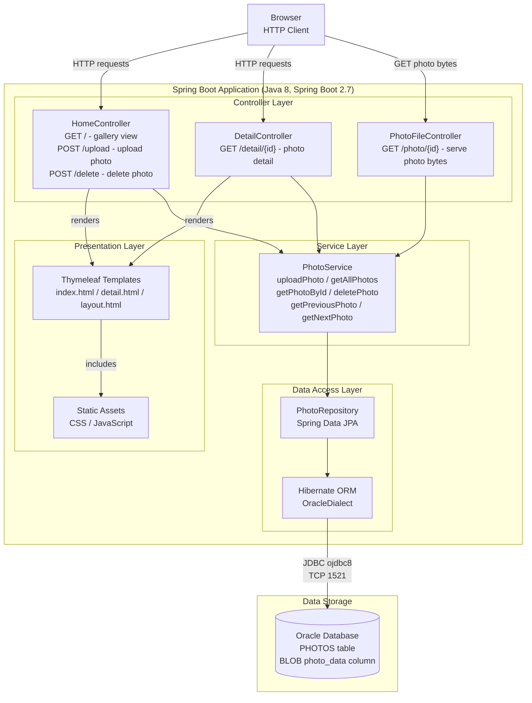

# Architecture Diagram

A Spring Boot photo album application that stores and serves photos using Oracle Database BLOB storage, containerized with Docker.

## Application Architecture

```mermaid
flowchart TD
    Browser["Browser\nHTTP Client"]

    subgraph App["Spring Boot Application (Java 8, Spring Boot 2.7)"]
        subgraph Presentation["Presentation Layer"]
            Templates["Thymeleaf Templates\nindex.html / detail.html / layout.html"]
            Static["Static Assets\nCSS / JavaScript"]
        end

        subgraph Controllers["Controller Layer"]
            HomeCtrl["HomeController\nGET / - gallery view\nPOST /upload - upload photo\nPOST /delete - delete photo"]
            DetailCtrl["DetailController\nGET /detail/{id} - photo detail"]
            FileCtrl["PhotoFileController\nGET /photo/{id} - serve photo bytes"]
        end

        subgraph Services["Service Layer"]
            PhotoSvc["PhotoService\nuploadPhoto / getAllPhotos\ngetPhotoById / deletePhoto\ngetPreviousPhoto / getNextPhoto"]
        end

        subgraph Persistence["Data Access Layer"]
            Repo["PhotoRepository\nSpring Data JPA"]
            JPA["Hibernate ORM\nOracleDialect"]
        end
    end

    subgraph Storage["Data Storage"]
        OracleDB[("Oracle Database\nPHOTOS table\nBLOB photo_data column")]
    end

    Browser -- "HTTP requests" --> HomeCtrl
    Browser -- "HTTP requests" --> DetailCtrl
    Browser -- "GET photo bytes" --> FileCtrl
    HomeCtrl -- "renders" --> Templates
    DetailCtrl -- "renders" --> Templates
    Templates -- "includes" --> Static
    HomeCtrl --> PhotoSvc
    DetailCtrl --> PhotoSvc
    FileCtrl --> PhotoSvc
    PhotoSvc --> Repo
    Repo --> JPA
    JPA -- "JDBC ojdbc8\nTCP 1521" --> OracleDB
```
