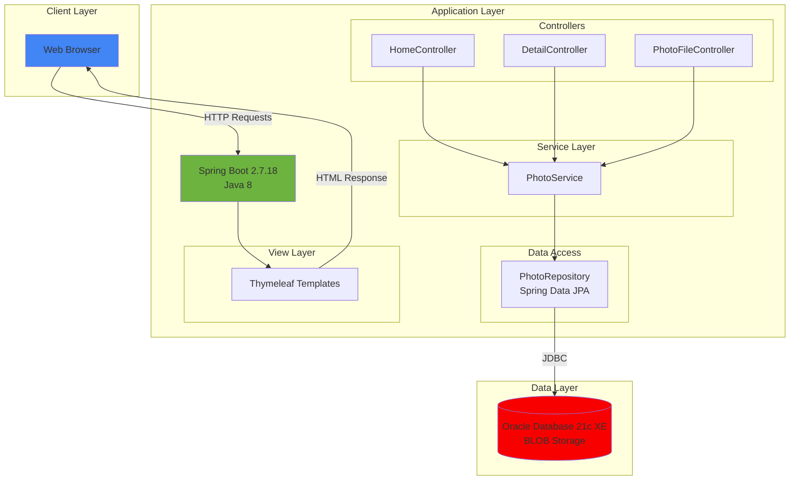
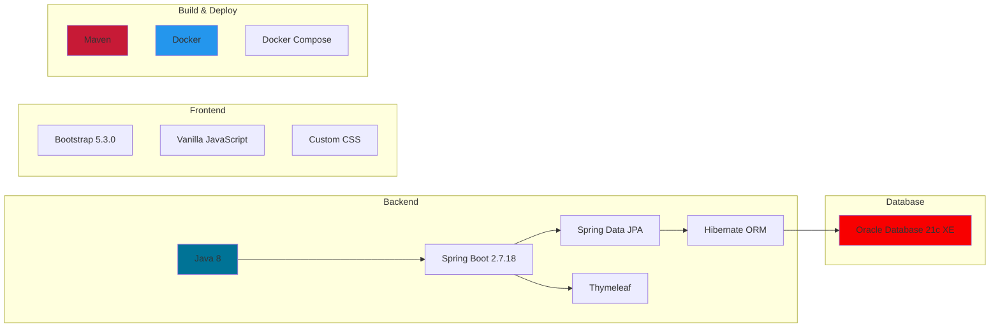
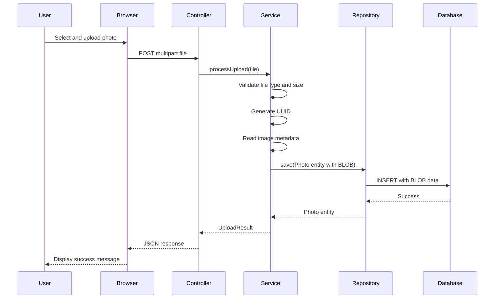
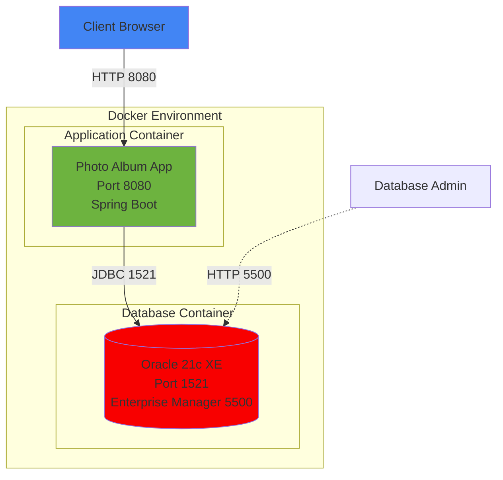

# Photo Album Application - Architecture Diagram

## Current Architecture

## Technology Stack

## Data Flow - Photo Upload

## Key Components

### Application Components
- **Controllers**: Handle HTTP requests for home, detail, and file upload endpoints
- **Service Layer**: Business logic for photo processing and validation
- **Repository**: Spring Data JPA interface for database operations
- **Model**: Photo entity with metadata and BLOB data

### Database Schema
- **PHOTOS Table**: Stores photo metadata and binary data
  - ID (UUID primary key)
  - File metadata (name, size, MIME type)
  - Image dimensions (width, height)
  - PHOTO_DATA (BLOB - stores actual image bytes)
  - Upload timestamp

### Storage Architecture
- Photos stored as BLOBs directly in Oracle Database
- No file system dependencies
- UUID-based unique identifiers for cache management

## Configuration Details

### Database Connection
- **Driver**: Oracle JDBC (ojdbc8)
- **URL**: jdbc:oracle:thin:@oracle-db:1521/FREEPDB1
- **Dialect**: Oracle Dialect
- **Schema Management**: Hibernate DDL auto-create

### File Upload Settings
- **Max File Size**: 10MB per file
- **Max Request Size**: 50MB total
- **Allowed Types**: JPEG, PNG, GIF, WebP
- **Max Files**: 10 files per upload

## Deployment Architecture

## Assessment Summary

Based on the AppCAT assessment report:

- **Total Issues**: 7 issues identified
- **Total Incidents**: 26 code locations requiring attention
- **Story Points**: 84 (estimated effort for modernization)

### Issue Categories
- **Database Migration**: 6 incidents - Oracle to Azure-compatible database
- **Framework Upgrade**: 10 incidents - Spring Boot modernization
- **Java Version Upgrade**: 3 incidents - Java 8 to modern LTS version
- **Local Credentials**: 3 incidents - Hardcoded credentials to secure storage
- **Spring Migration**: 4 incidents - Spring framework best practices

### Severity Distribution
- **Mandatory**: 13 incidents (must fix)
- **Potential**: 13 incidents (recommended to fix)
- **Optional**: 0 incidents
- **Information**: 0 incidents

### Target Platforms Assessed
- Azure Kubernetes Service (AKS)
- Azure App Service
- Azure Container Apps

---

*Generated on: 2026-02-12*
*Assessment Tool: Java AppCAT CLI v1.0.0*
