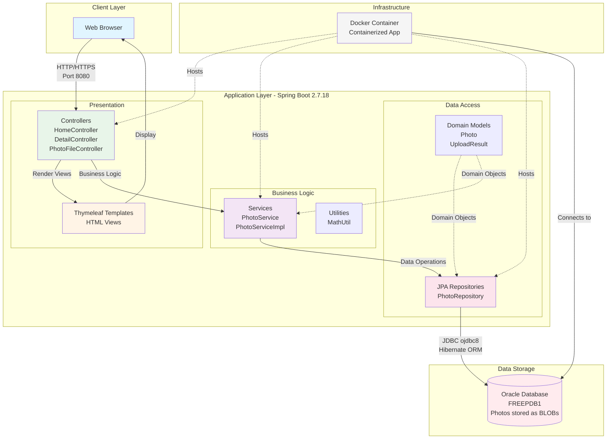
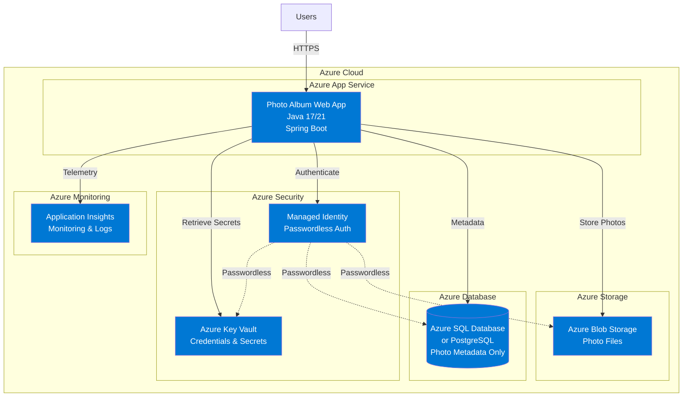

# PhotoAlbum-Java Architecture Diagram

This diagram shows the high-level architecture of the PhotoAlbum Java application based on the assessment results.

## Current Architecture

## Technology Stack

| Layer | Technologies |
|-------|-------------|
| **Language** | Java 8 |
| **Framework** | Spring Boot 2.7.18 |
| **Web** | Spring MVC, Thymeleaf |
| **Data Access** | Spring Data JPA, Hibernate |
| **Database** | Oracle Database (ojdbc8) |
| **Build Tool** | Maven |
| **Container** | Docker |
| **Testing** | Spring Boot Test, H2 (test DB) |

## Key Components

### Presentation Layer
- **Thymeleaf Templates**: Server-side rendered HTML views for photo gallery
- **Controllers**: Handle HTTP requests for home page, photo details, and file operations
- **Endpoints**:
  - `GET /` - Display photo gallery
  - `POST /upload` - Upload photos
  - `GET /photo/{id}` - View photo details
  - `GET /photo/{id}/file` - Download photo file
  - `DELETE /photo/{id}` - Delete photo

### Business Logic Layer
- **PhotoService**: Core business logic for photo management
  - Photo upload with validation (file type, size)
  - Image dimension extraction
  - Photo retrieval and deletion
  - Navigation between photos
- **Validation**: File type checking, size limits, empty file detection

### Data Access Layer
- **PhotoRepository**: JPA repository for database operations
- **Photo Model**: Entity representing photo metadata and binary data
- **Database Operations**:
  - Store photos as BLOBs in Oracle database
  - Query photos by ID, upload date
  - Support for pagination and ordering

### Data Storage
- **Oracle Database**: Primary data store
  - Photo metadata (filename, size, dimensions, upload date)
  - Photo binary data (stored as BLOB)
  - Schema managed by Hibernate DDL auto-create

## Data Flow

### Photo Upload Flow
1. User selects photos in browser
2. Browser sends multipart/form-data POST to `/upload`
3. HomeController receives request
4. PhotoService validates files (type, size)
5. PhotoService extracts image dimensions
6. Photo entity created with binary data
7. PhotoRepository saves to Oracle database (BLOB)
8. Response returns uploaded photo metadata

### Photo Display Flow
1. User requests home page (`GET /`)
2. HomeController queries all photos
3. PhotoService retrieves photos from database
4. Thymeleaf renders gallery view with photo thumbnails
5. Photo files served via `/photo/{id}/file` endpoint
6. PhotoFileController retrieves binary data from database
7. Binary data streamed to browser

## Assessment Findings

### Strengths
- ✅ Layered architecture with clear separation of concerns
- ✅ Spring Boot framework provides cloud-ready foundation
- ✅ Docker support for containerization
- ✅ Input validation for file uploads

### Areas for Cloud Migration
- ⚠️ **Database**: Oracle DB should migrate to Azure SQL Database or PostgreSQL
- ⚠️ **File Storage**: BLOB storage should migrate to Azure Blob Storage
- ⚠️ **Configuration**: Hardcoded credentials need Azure Key Vault integration
- ⚠️ **Java Version**: Upgrade from Java 8 to Java 17 or 21
- ⚠️ **Monitoring**: Add Azure Application Insights
- ⚠️ **Database Schema**: Change ddl-auto from 'create' to 'validate'

## Recommended Azure Architecture

## Migration Benefits

| Current | After Azure Migration |
|---------|----------------------|
| Oracle Database with BLOBs | Azure SQL + Blob Storage (cost-effective) |
| Hardcoded credentials | Azure Key Vault + Managed Identity (secure) |
| Java 8 | Java 17/21 (modern, performant) |
| Manual scaling | Auto-scaling with Azure App Service |
| Limited monitoring | Comprehensive monitoring with App Insights |
| Docker Compose | Azure Container Instances or App Service |

---

*Generated from application assessment on 2026-02-12*
