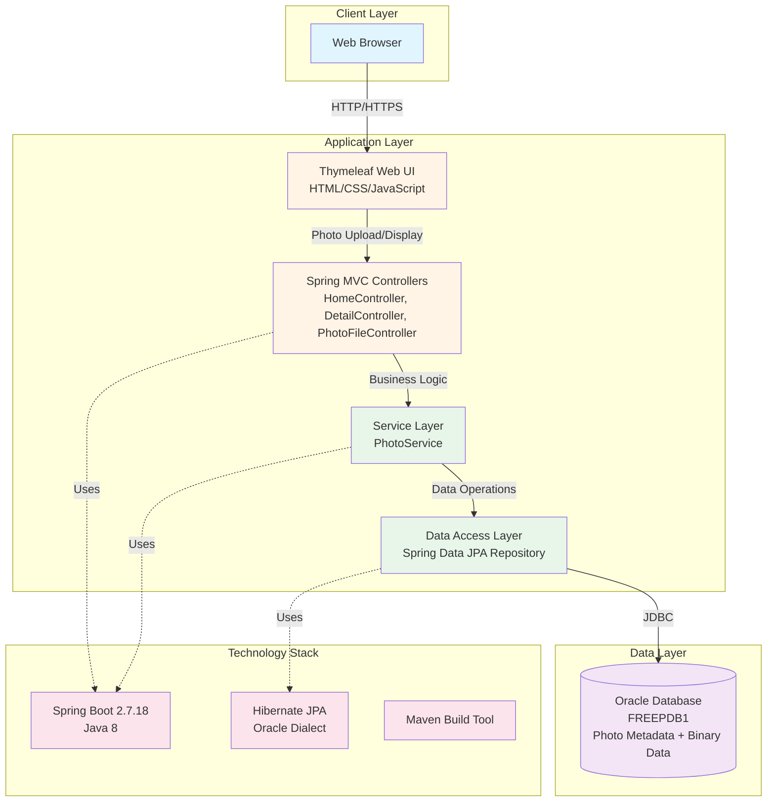
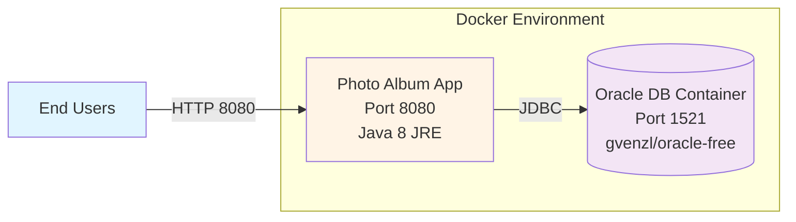
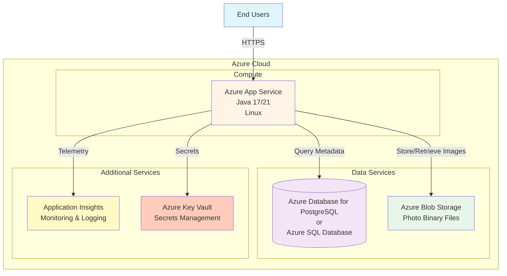

# Photo Album Application - Architecture Diagram

## Current Architecture

## Application Components

### Presentation Layer
- **Thymeleaf Templates**: Server-side HTML rendering (index.html, detail.html, layout.html)
- **Static Resources**: CSS (site.css), JavaScript (upload.js)
- **Controllers**: 
  - `HomeController`: Gallery view and photo upload
  - `DetailController`: Individual photo details
  - `PhotoFileController`: Photo file serving

### Business Layer
- **PhotoService**: Photo upload validation, image processing, and business logic
- **Validation**: File size limits (10MB), MIME type validation (JPEG, PNG, GIF, WebP)
- **Utilities**: MathUtil for calculations

### Data Layer
- **Photo Entity**: JPA entity with metadata (ID, filename, size, dimensions, MIME type)
- **PhotoRepository**: Spring Data JPA repository for database operations
- **Oracle Database**: Stores photo metadata and binary data (BLOB)

## Technology Stack

| Component | Technology | Version |
|-----------|-----------|---------|
| Framework | Spring Boot | 2.7.18 |
| Language | Java | 8 |
| Build Tool | Maven | 3.x |
| Template Engine | Thymeleaf | (Spring Boot managed) |
| ORM | Hibernate/JPA | (Spring Boot managed) |
| Database | Oracle Database | Free 23ai |
| JDBC Driver | Oracle JDBC | ojdbc8 |
| Validation | Spring Validation | (Spring Boot managed) |
| File Operations | Apache Commons IO | 2.11.0 |
| Container | Docker | Multi-stage build |

## Data Flow

1. **Photo Upload Flow**:
   - User selects photos in web browser
   - JavaScript uploads files via POST /upload
   - HomeController receives MultipartFile array
   - PhotoService validates files (size, type, dimensions)
   - Service stores binary data in Oracle BLOB
   - Photo metadata saved via PhotoRepository
   - Response returns success/failure for each file

2. **Photo Display Flow**:
   - User visits homepage
   - HomeController fetches all photos via PhotoService
   - Service queries PhotoRepository
   - Repository fetches from Oracle Database
   - Thymeleaf renders gallery with photo metadata
   - PhotoFileController serves binary image data

## Deployment Architecture

## Key Features

- **Photo Upload**: Multi-file upload with validation
- **Photo Gallery**: Thumbnail view with pagination
- **Photo Details**: Full-size view with metadata
- **File Storage**: Binary data stored in Oracle BLOB
- **Image Processing**: Dimension calculation and validation
- **Responsive UI**: Mobile-friendly design

## Database Schema

**PHOTOS Table**:
- `id` (VARCHAR2 36): UUID primary key
- `original_file_name` (VARCHAR2 255): Original filename
- `photo_data` (BLOB): Binary image data
- `stored_file_name` (VARCHAR2 255): Generated filename (UUID)
- `file_path` (VARCHAR2 500): Relative path
- `file_size` (NUMBER): File size in bytes
- `mime_type` (VARCHAR2 50): Image MIME type
- `uploaded_at` (TIMESTAMP): Upload timestamp
- `width` (NUMBER): Image width in pixels
- `height` (NUMBER): Image height in pixels
- Index on `uploaded_at` for efficient queries

## Recommended Azure Target Architecture

## Migration Recommendations

1. **Upgrade Java Version**: Migrate from Java 8 to Java 17 or 21 (LTS)
2. **Upgrade Spring Boot**: Update from 2.7.18 to 3.x for better performance and security
3. **Database Migration**: 
   - Replace Oracle with Azure Database for PostgreSQL or Azure SQL Database
   - Migrate BLOB storage to Azure Blob Storage for cost efficiency
4. **Externalize Configuration**: Use Azure Key Vault for sensitive configuration
5. **Add Monitoring**: Integrate Application Insights for observability
6. **Enhance Security**: 
   - Update Commons IO (security advisories)
   - Implement Azure AD authentication
   - Use managed identities
7. **Container Deployment**: Deploy to Azure App Service (Container) or Azure Container Apps
8. **CI/CD**: Set up Azure DevOps or GitHub Actions for automated deployment

---
*Generated: 2026-02-12*
*Tool: AppCAT Assessment*
